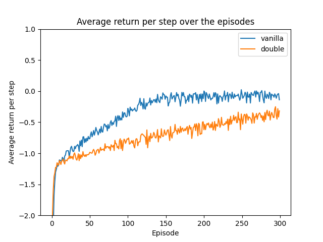
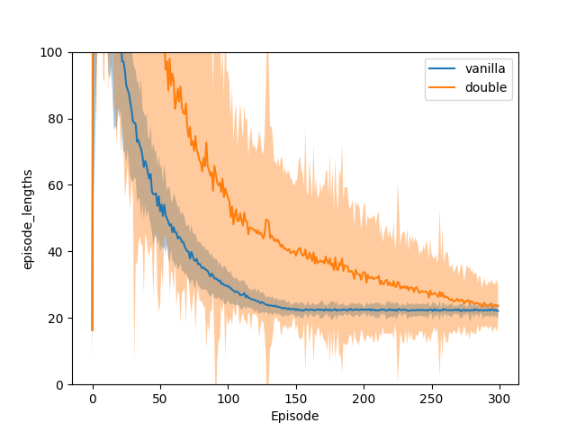
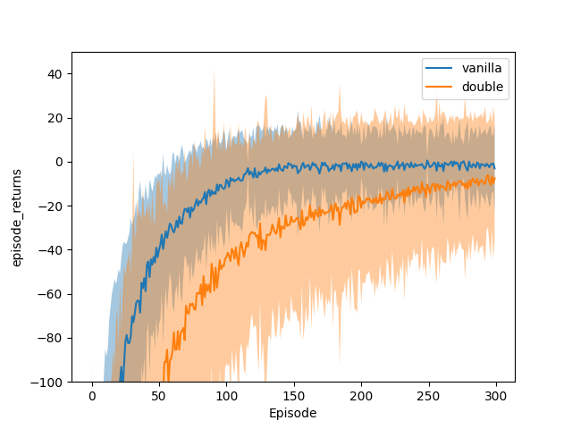
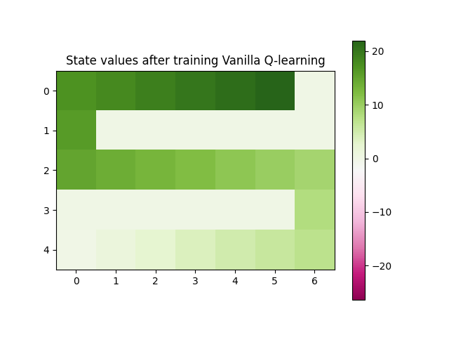
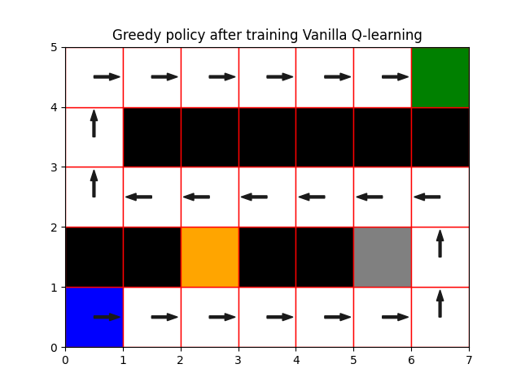
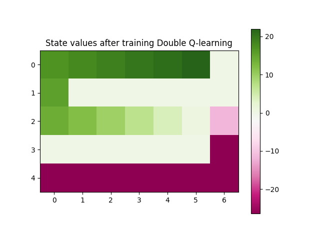
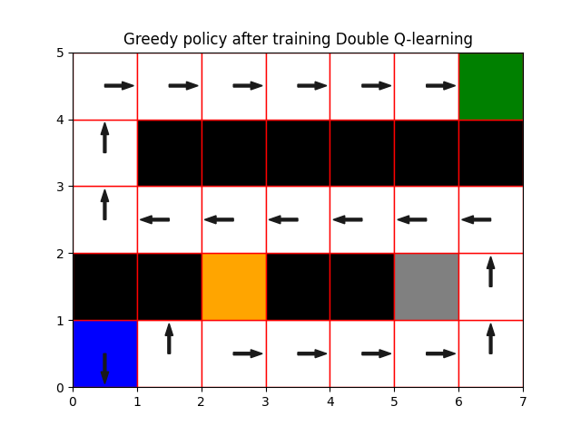

This project compares the Vanilla Q-learning and Double Q-learning algorithms. 
Grid worlds (inherited classes from gym.Env with 4-dimensional action space NWSE) can be defined with various cell types:
* Lava: reward -100 and episode terminates
* Cliff: reward -100, episode continues from start position
* Wall: reward -1, no position change
* Regular: reward -1, regular position change

And various types of stochasticity:
* State transition stochasticity: defines some probability of veering off to left/right when moving forward
* Reward stochasticity: reward per step is [-12,+10] with equal probability (instead of deterministic -1)

Example experimental setups are in `./configs`.
Required Python packages are in `environment.yaml`.
To reproduce results, run
```
python main.py [CONFIG_NAME.yaml]
```

# Example experiment
Here are some results (200 seeds, 300 episodes per seed) for a simple maze with walls (black), lava (orange) and cliff (grey) cells. Start position in blue, goal position in green.
<p float="left">
  
  
  
</p>

<p float="left">
  
   
</p>
<p float="left">
  
   
</p>
